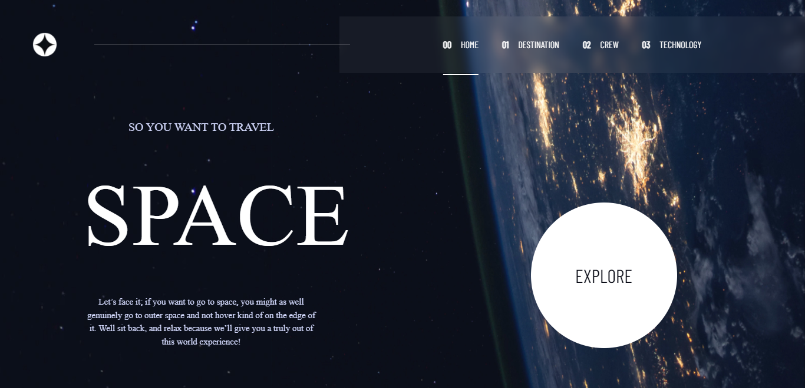

#  Space tourism website
This is a solution to the [Space tourism website challenge on Frontend Mentor](https://www.frontendmentor.io/challenges/space-tourism-multipage-website-gRWj1URZ3). 

## Table of contents

- [Overview](#overview)
  - [The challenge](#the-challenge)
  - [Screenshot](#screenshot)
  - [Links](#links)
- [My process](#my-process)
  - [Built with](#built-with)
- [Author](#author)

## Overview

### The challenge

Users should be able to:

- View the optimal layout for each of the website's pages depending on their device's screen size
- See hover states for all interactive elements on the page
- View each page and be able to toggle between the tabs to see new information

### Screenshot

### Links

- Solution URL: [Space Tourism](https://space-tourism-newton-w.vercel.app/)
<!-- - Live Site URL: [Add live site URL here](https://https://space-tourism-newton-w.vercel.app/.com) -->

## My process

### Built with

- Mobile-first workflow
- [Next.js](https://nextjs.org/) 
- [Tailwind Css](https://https://tailwindcss.com/) - For styles

## Author

- Website - [Newton Warui](https://www.newtonwarui.com)
- Frontend Mentor - [@newton-w](https://www.frontendmentor.io/profile/newton-w)

